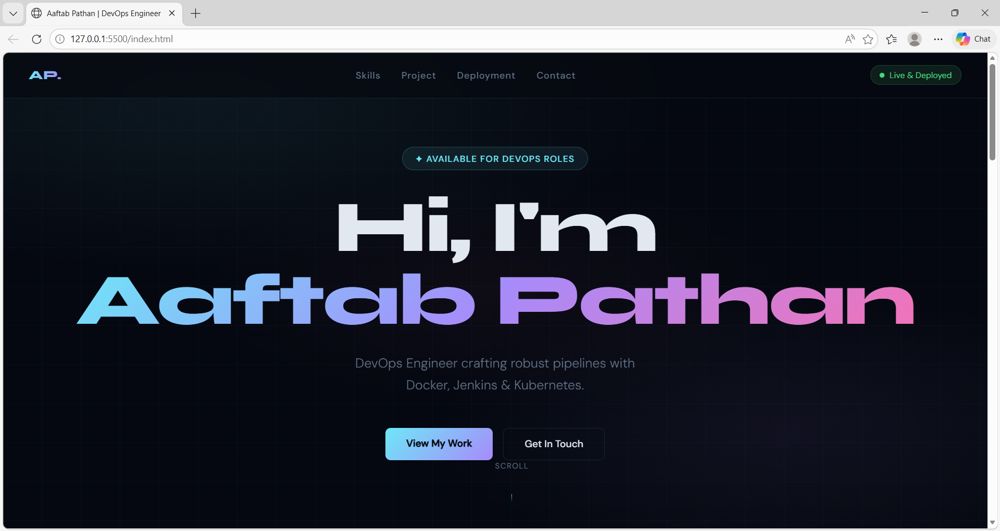
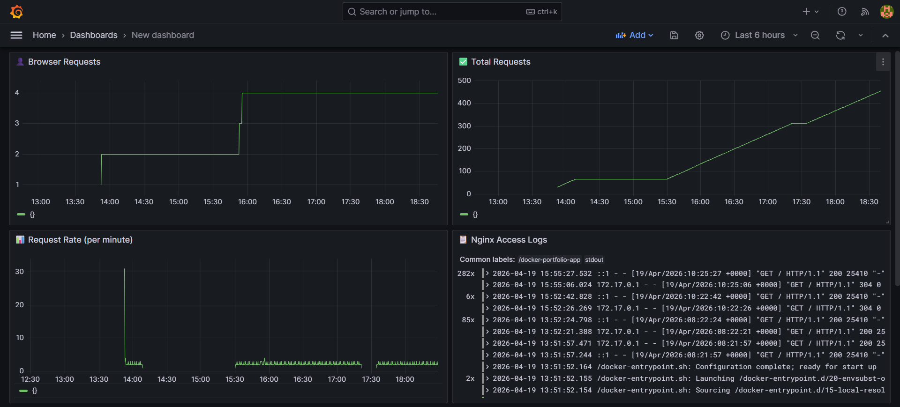
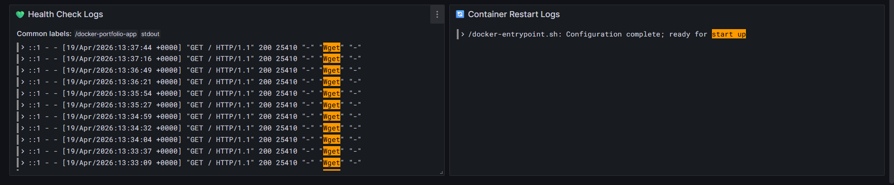
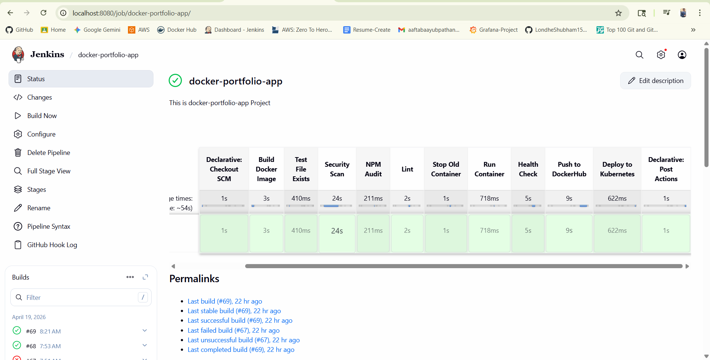

# 🚀 Docker Portfolio App - DevOps Project

A complete **production-ready DevOps project** demonstrating CI/CD, containerization, Kubernetes deployment, and monitoring.

---

## 📌 Project Overview

This project showcases a full DevOps lifecycle:

* Containerized Node.js application
* Nginx reverse proxy & static frontend
* CI/CD pipeline using Jenkins
* Kubernetes deployment (scalable & self-healing)
* Monitoring & logging (Grafana, Loki, Promtail)

---

## 🏗️ Architecture

```text
User
 ↓
Nginx (Reverse Proxy + Static Frontend)
 ↓
Node.js App (Docker Container)
 ↓
Kubernetes Cluster
 ↓
Monitoring Stack:
   → Promtail (Log Collector)
   → Loki (Log Storage)
   → Grafana (Visualization)
```

---

## ⚙️ Tech Stack

* **Backend:** Node.js (Express)
* **Frontend:** HTML (served via Nginx)
* **Containerization:** Docker
* **Orchestration:** Kubernetes
* **CI/CD:** Jenkins
* **Monitoring:** Grafana, Loki, Promtail
* **Security:** Trivy, NPM Audit
* **Linting:** ESLint

---

## 📁 Project Structure

```text
docker-portfolio-app/
│
├── app/                  # Node.js application
│   ├── app.js
│   ├── index.html
│   ├── package.json
│   └── eslint.config.js
│
├── docker/               # Docker & Nginx setup
│   ├── docker-compose.yml
│   └── nginx.conf
│
├── k8s/                  # Kubernetes manifests
│   ├── deployment.yaml
│   ├── service.yaml
│   ├── configmap.yaml
│   └── secret.yaml (ignored)
│
├── monitoring/           # Logging stack
│   ├── docker-compose.yml
│   ├── loki-config.yml
│   └── promtail-config.yml
│
├── Dockerfile            # Node.js app container
├── Jenkinsfile           # CI/CD pipeline
├── .env                  # Environment variables
├── .dockerignore
├── .gitignore
└── README.md
```

---

## 🚀 Getting Started (Local Setup)

### 1️⃣ Clone Repository

```bash
git clone https://github.com/AaftabPathan/docker-portfolio-app.git
cd docker-portfolio-app
```

---

### 2️⃣ Run Node App Locally

```bash
cd app
npm install
npm start
```

👉 App runs on: `http://localhost:3000`

---

## 🐳 Docker Setup

### 🔨 Build Image

```bash
docker build -t docker-portfolio-app .
```

---

### ▶️ Run Container

```bash
docker run -d -p 3000:3000 docker-portfolio-app
```

---

## 🌐 Docker Compose (App + Nginx)

```bash
cd docker
docker-compose up -d
```

👉 Access via: `http://localhost:8081`

---

## ☸️ Kubernetes Deployment

### ▶️ Apply Manifests

```bash
kubectl apply -f k8s/
```

---

### 🌐 Access Application

```bash
http://<Node-IP>:30007
```

---

### 📊 Scaling

```bash
kubectl scale deployment portfolio-app --replicas=3
```

---

## ⚙️ Environment Variables

```env
PORT=3000
```

* Used for dynamic configuration
* Managed via `.env` (local) & ConfigMap (K8s)

---

## 🔄 CI/CD Pipeline (Jenkins)

### 🚀 Pipeline Flow

```text
GitHub → Jenkins → Build → Test → Scan → DockerHub → Kubernetes
```

---

### 📌 Stages

* Build Docker image
* Run tests
* Security scan (Trivy)
* Dependency audit
* Linting (ESLint)
* Deploy container
* Health check
* Push to DockerHub
* Deploy to Kubernetes

---

## 📊 Monitoring & Logging

### 🔄 Flow

```text
Containers → Promtail → Loki → Grafana
```

---

### ▶️ Run Monitoring

```bash
cd monitoring
docker-compose up -d
```

---

### 🌐 Access Grafana

```text
http://localhost:3001
```

**Login:**

* Username: admin
* Password: admin123

---

## 🔐 Security Best Practices

* `.env` ignored
* Kubernetes secrets not exposed
* Trivy image scanning
* NPM audit for dependencies

---

## 📦 Docker Optimization

* `.dockerignore` used
* Lightweight Alpine images
* Reduced image size

---

## ❤️ Health Checks

* Docker health check
* Kubernetes liveness & readiness probes
* CI/CD validation checks

---

## 💡 Key Features

* Scalable Kubernetes deployment
* Automated CI/CD pipeline
* Centralized logging system
* Secure configuration management
* Production-ready architecture

---

## This project demonstrates a complete DevOps pipeline with live deployment, monitoring, and CI/CD automation.

## 📸 Screenshots

### 🖥️ Application UI

## Running containerized application via Nginx reverse proxy


### 📊 Grafana Dashboard


Centralized logging visualization using Loki & Grafana


### 🔄 Jenkins Pipeline

Successful CI/CD pipeline execution


## 👨‍💻 Author

**Aaftab Pathan**

* GitHub: https://github.com/AaftabPathan
* LinkedIn: https://linkedin.com/in/aaftabpathan
* Gmail: aaftabaayubpathan@gmail.com

---

## ⭐ Support 

If you like this project, give it a ⭐ on GitHub!
